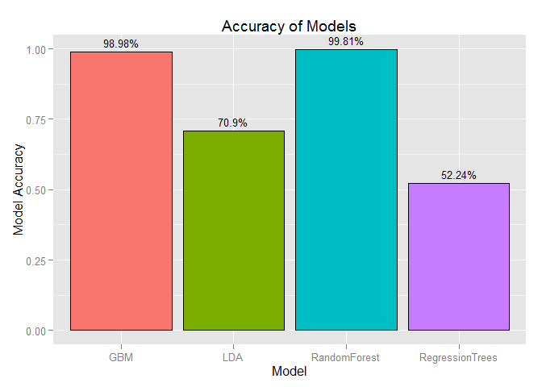

# Practical Machine Learning

## Introduction

Using devices such as Jawbone Up, Nike FuelBand, and Fitbit it is now possible to collect a large amount of data about personal activity relatively inexpensively. These type of devices are part of the quantified self movement - a group of enthusiasts who take measurements about themselves regularly to improve their health, to find patterns in their behavior, or because they are tech geeks. One thing that people regularly do is quantify how much of a particular activity they do, but they rarely quantify how well they do it.

More information is available from the website here: http://groupware.les.inf.puc-rio.br/har (see the section on the Weight Lifting Exercise Dataset).

Tha main goal of this project :

 * Predict the manner in which they did the exercise depicted by the classe variable.
 
 * Build a prediction model using different features and cross-validation technique.
 
 * Calculate the out of sample error.
 
 * Use the prediction model to predict 20 different test cases provided.


### Data retrieval, processing and transformation

Download the **training** data from  https://d396qusza40orc.cloudfront.net/predmachlearn/pml-training.csv

Download the **test** data from https://d396qusza40orc.cloudfront.net/predmachlearn/pml-testing.csv 

## Load the data and check number of records

```r
set.seed(55) #for reproducibility

raw_training <- read.csv("./Data/pml-training.csv", na.strings=c("NA",""))
raw_testing <- read.csv("./Data/pml-testing.csv", na.strings=c("NA",""))
```

There are  **19622** records in  **pml_training** and **20** records in  **pml_testing** dataset

## Process the data
Check for the total number of NAs in the dataset and then total NAs in each training and testing datasets.


```
## [1] 1921600
```

```
## na_train
##     0 19216 
##    60   100
```

```
## na_test
##   0  20 
##  60 100
```
From above values it is there are 60 variables with 0 NA values while the rest have NA values for all the rows of the dataset, these records will be exculded

 * Exculde from pml_training dataset

```r
colNACounts <- colSums(is.na(raw_training))  # getting NA counts for all columns
badColumns <- colNACounts >= 19000           # ignoring columns with majority NA values
training_Data <- raw_training[!badColumns]   # getting clean data
sum(is.na(training_Data))                    # checking for NA values
```

```
## [1] 0
```

```r
training_Data <- training_Data[, c(7:60)] # removing unnecessary columns
```

* Exculde from pml_testing dataset

```r
colNACounts <- colSums(is.na(raw_testing))  # getting NA counts for all columns
badColumns <- colNACounts >= 20             # ignoring columns with majority NA values
testing_Data <- raw_testing[!badColumns]    # getting clean data
sum(is.na(testing_Data))                    # checking for NA values
```

```
## [1] 0
```

```r
testing_Data <- testing_Data[, c(7:60)]     # removing Unnecessary columns
```

### Exploratory Data Analysis

```r
summary(training_Data$classe)
```

```
##    A    B    C    D    E 
## 5580 3797 3422 3216 3607
```

```r
dim(training_Data)
```

```
## [1] 19622    54
```

```r
plot(training_Data$classe, col=cm.colors(6), main = "`classe` frequency plot", xlab = "Types of Weight Lifting Exercices")
```

 

### Model Building

Build a machine learning model for predicting the **classe** value based on the other features of the dataset.

##### Data partitioning

Partition the data into tranining, testing and cross-validation:


```r
library (caret)
#Partition rows into training and crossvalidation
inTrain <- createDataPartition(training_Data$classe, p = 0.6, list=FALSE)
training_PML <- training_Data[inTrain,]
crossv <- training_Data[-inTrain,]

inTrain <- createDataPartition(crossv$classe, p = 0.75,list=FALSE)
testing_PML <- crossv[ -inTrain,]
crossv_PML <- crossv[inTrain,]
```
##### Training the models


  * Apply Recursive Partitioning and Regression Trees (RPART) analysis:


```r
 modelRPART <- train(training_PML$classe ~., data=training_PML, method="rpart")
```
 * Apply Naive Bayes (GBM) analysis:
 

```r
modelGBM <- train(training_PML$classe ~., data=training_PML, method="gbm", verbose=FALSE)
```

 * Apply Random forests (RF) analysis using 4-fold validation:
  

```r
modelRF <- train(training_PML$classe ~., data = training_PML, method = "rf", ncores = 8, prox = TRUE, 
               trControl = trainControl(method = "cv", number = 4, allowParallel = TRUE))
```

 * Apply Linear discriminant analysis (LDA) analysis:
 

```r
modelLDA <- train(training_PML$classe ~., data=training_PML, method="lda")
```

 * Cross validate analysis results by using validation data set:


```r
predRPART <- predict(modelRPART,  crossv_PML)
predGBM <- predict(modelGBM,  crossv_PML)
predRF <- predict(modelRF,  crossv_PML)
predLDA <- predict(modelLDA,  crossv_PML)
```

##### Accuracy from each model:


```r
accuracyRPART <- confusionMatrix(predRPART, crossv_PML$classe)$overall["Accuracy"]
accuracyGBM <- confusionMatrix(predGBM, crossv_PML$classe)$overall["Accuracy"]
accuracyRF <- confusionMatrix(predRF, crossv_PML$classe)$overall["Accuracy"]
accuracyLDA <- confusionMatrix(predLDA, crossv_PML$classe)$overall["Accuracy"]
```

 * Accuracy of model **Recursive Partitioning and Regression Trees (RPART)** is **0.5224** 
 * Accuracy of model **Naive Bayes (GBM)** is **0.9898** 
 * Accuracy of model **Random forest (RF)** is **0.9981** 
 * Accuracy of model **Linear discriminant analysis (LDA)** is **0.709** 

#### Model Selection
"Random Forest" model has produced the best reusults, with accuracy of **99.81%**  on validation data set. We'll choose this model as our best model.


```r
accuracyPlot
```

 

##### Out of sample accuracy 

Calculate the "out of sample" accuracy with selected model i.e "Random Forest", which is the prediction accuracy of our model on the testing data set.


```r
testing_pred <- predict(modelRF, testing_PML)
sampAcc_modelRF <- confusionMatrix(testing_pred, testing_PML$classe)$overall["Accuracy"]
```
 
 * The "out of sample" accuracy is **99.95%**
 
### Prediction Assignment
 
Apply the machine learning algorithm to each of the 20 test cases in the testing data set provided.


```r
answers <- predict(modelRF, testing_Data)
answers <- as.character(answers)
```
###### Final prediction on test set


```r
answers
```

```
##  [1] "B" "A" "B" "A" "A" "E" "D" "B" "A" "A" "B" "C" "B" "A" "E" "E" "A"
## [18] "B" "B" "B"
```
 Write the answers to files so that it can uploaded
 

```r
 pml_write_files = function(x) {
    n = length(x)
    for (i in 1:n) {
        filename = paste0("problem_id_", i, ".txt")
        write.table(x[i], file = filename, quote = FALSE, row.names = FALSE, 
            col.names = FALSE)
    }
}

pml_write_files(answers)
```

### Conclusions

For this analysis "Random Forest"  machine learning algorithm was selected as it gave highest accuracy classifier on test dataset and also the algorithm balances bias and variance trade-offs by settling for a balanced model.
